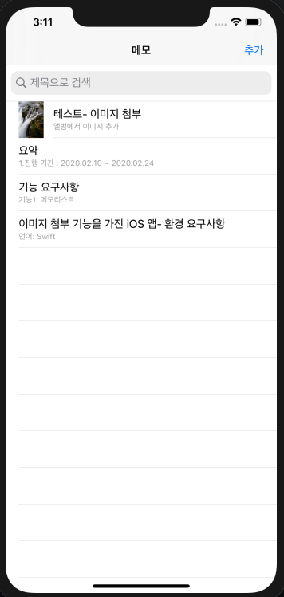
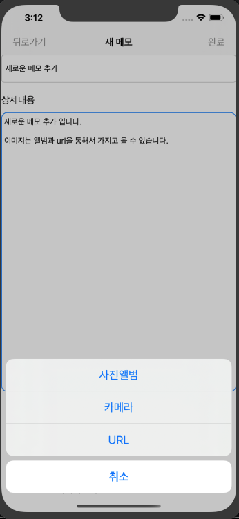
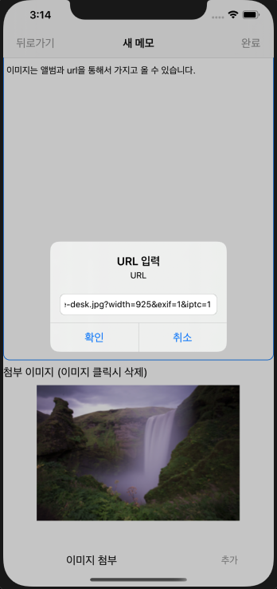
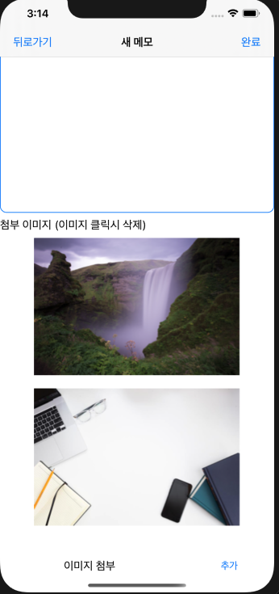
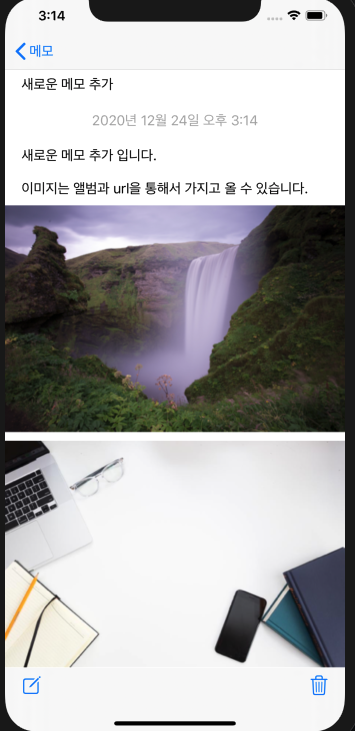

# [이미지 첨부 기능을 가진 iOS 앱]

## 환경 요구사항
+ 언어: Swift
+ Deployment Target: iOS 10.0

## 기능 요구사항

+ 기능1: 메모리스트
  + 로컬 영역에 저장된 메모를 읽어 리스트 형태로 화면에 표시합니다.
  + 리스트에는 메모에 첨부되어있는 이미지의 썸네일, 제목, 글의 일부가 보여집니다. (이미지가 n개일 경우, 첫 번째 이미지가 썸네일이 되어야 함)
  + 리스트의 메모를 선택하면 메모 상세 보기 화면으로 이동합니다.
  + 새 메모 작성하기 기능을 통해 메모 작성 화면으로 이동할 수 있습니다.

+ 기능2: 메모 상세 보기
  + 작성된 메모의 제목과 본문을 볼 수 있습니다.
  + 메모에 첨부되어있는 이미지를 볼 수 있습니다. (이미지는 n개 존재 가능)
  + 메뉴를 통해 메모 내용 편집 또는 삭제가 가능합니다.

+ 기능3: 메모 편집 및 작성
  + 제목 입력란과 본문 입력란, 이미지 첨부란이 구분되어 있어야 합니다. (글 중간에 이미지가 들어갈 수 있는 것이 아닌, 첨부된 이미지가 노출되는 부분이 따로 존재)
  + 이미지 첨부란의 ‘추가' 버튼을 통해 이미지 첨부가 가능합니다. 첨부할 이미지는 다음 중 한 가지 방법을 선택해서 추가할 수 있습니다. 이미지는 0개 이상 첨부할 수 있습니다. 외부 이미지의 경우, 이미지를 가져올 수 없는 경우(URL이 잘못되었거나)에 대한 처리도 필요합니다.

  + 사진첩에 저장되어 있는 이미지
  + 카메라로 새로 촬영한 이미지
  + 외부 이미지 주소(URL)
  + 편집 시에는 기존에 첨부된 이미지가 나타나며, 이미지를 더 추가하거나 기존 이미지를 삭제할 수 있습니다.
  
## ■ 앱 실행화면

  <figure>
     
     <figcaption>⬅︎ 앱 메인 화면</figcaption>
  </figure>
<figure>
     
     <figcaption>⬅︎ 메모 추가</figcaption>
  </figure><figure>
     
     <figcaption>⬅︎ 이미지 url을 통한 추가</figcaption>
  </figure>

  <figure>
     
     <figcaption>⬅︎ 이미지 첨부 후</figcaption>
  </figure>
  <figure>
     
     <figcaption>⬅︎ 메모 화면</figcaption>
  </figure>

  
## 요약

- 1.진행 기간 : 2020.02.10 ~ 2020.02.24
- 2.주요 내용 : 프로그래머스에서 주최한 “Line 신입 개발자 채용 앱 개발 챌린지”에 참여한 작품으로 iOS에 메모장 클론 앱 프로젝트입니다.
- 3.본인이 공헌한 점 : 개인 프로젝트로서 앱 설계부터 구현까지 모두 스스로 개발하였습니다. 
- 4.사용한 Skill 또는 지식 : swift와 MVC 패턴을 이용하여 개발, 메모 데이터를 저장하기 위하여 core data를 사용
- 5.결과/성과 : 상위 15% 성적을 받음(110점/174점 만점) / 코드 리뷰에서 MVC 패턴의 단점인 Massive View Controller를 지적받았고, 단점을 보완할 수 있는 MVVM 패턴의 공부를 하는 계기가 되었습니다.

